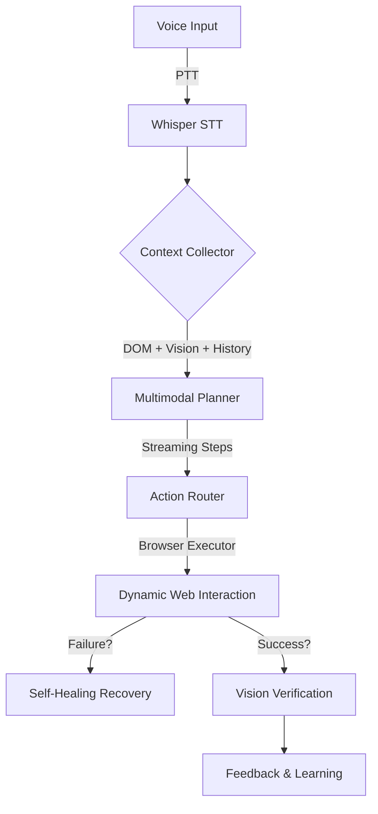

# 🎙️ JARVIS: The Autonomous Voice Agent


[](https://opensource.org/licenses/MIT)
[](https://www.python.org/downloads/)
[](https://playwright.dev/)

**JARVIS** is a high-performance, autonomous desktop assistant that transforms natural speech into complex web actions. Unlike traditional voice assistants that only answer questions, JARVIS **executes** work by navigating, interacting, and verifying tasks across any web application.

---

## 🚀 Key Features

### 🧠 Autonomous Browser Interaction
JARVIS doesn't just click buttons; it understands web interfaces.
- **Smart Scrolling & Navigation**: Automatically finds elements below the fold or across multiple pages.
- **Semantic DOM Targeting**: Prioritizes interactive elements based on visibility and importance.
- **Element Stability**: Intelligent waits for animations and network hydration to prevent "ghost clicks."

### 👁️ Vision-Augmented Reliability
Powered by **GPT-4o-mini Vision** for near-human task verification.
- **Goal Verification**: JARVIS captures screenshots to visually confirm if a task (e.g., "Message Sent") was actually completed.
- **Autonomous Diagnosis**: If a task fails or gets blocked by a CAPTCHA, JARVIS analyzes the screen and explains *why* in plain English.

### 🔄 Self-Healing & Adaptive Memory
- **Dynamic Re-Planning**: If an action fails, JARVIS automatically stops, re-scans the page, and generates a recovery plan.
- **Experiential Learning**: Remembers successful selectors and strategies for your favorite sites, getting faster with every use.

### 🎙️ Premium Voice Interface
- **Push-to-Talk (PTT)**: Low-latency interaction via `Ctrl+Space`. It stops listening the instant you release the key.
- **Multimodal Planning**: Sends layout snapshots with voice intent for context-aware reasoning.
- **Vocal Feedback (TTS)**: JARVIS talks back, announcing actions and results for an eyes-free experience.

### 👤 Multi-Expert Personas
- **Save & Load Agents**: Create specialized experts (e.g., "Research Specialist", "Shopping Buddy") with custom instructions and switch between them via voice.

---

## 🛠️ How It Works



---

## 📥 Setup

### 1. Installation
Clone the repository and run the automated setup:
```powershell
.\setup.ps1
```

### 2. Configuration
Edit your `.env` file with your preferences:
```env
# Intelligence
OPENAI_API_KEY=sk-...
OPENAI_MODEL=gpt-4o-mini

# Voice Settings
WHISPER_LANGUAGE=auto   # Supports 50+ languages
TTS_PROVIDER=local      # local | openai

# Persistence
BROWSER_PROFILE_PATH=C:\Users\YourUser\AppData\Local\JARVIS\profile
```

### 3. Run
```powershell
python core\orchestrator.py
```

---

## 🎮 Command Examples
- *"Open LinkedIn, search for AI Engineers in London, and summarize the first profile."*
- *"Go to Amazon and find a mechanical keyboard under $100 with 4+ stars."*
- *"Draft a professional reply to the last email from Sarah in Gmail."*
- *"Save this agent as my Research Assistant."*
- *"Switch to Research Assistant and summarize this article."*

---

## 🛡️ Safety & Privacy
- **Emergency Stop**: Tap `Esc` at any time to instantly kill all autonomous actions.
- **Confirmation Mode**: Sensitive actions (like sending messages) require voice or HUD confirmation by default.
- **Local Fallback**: Supports **Ollama** for 100% private, offline LLM processing.

---

## 🤝 Contributing
JARVIS is an evolving autonomous agent. We welcome contributions to our executor library and vision-verification heuristics!

---

**Built with ❤️ for the future of Autonomous Web Interaction.**
